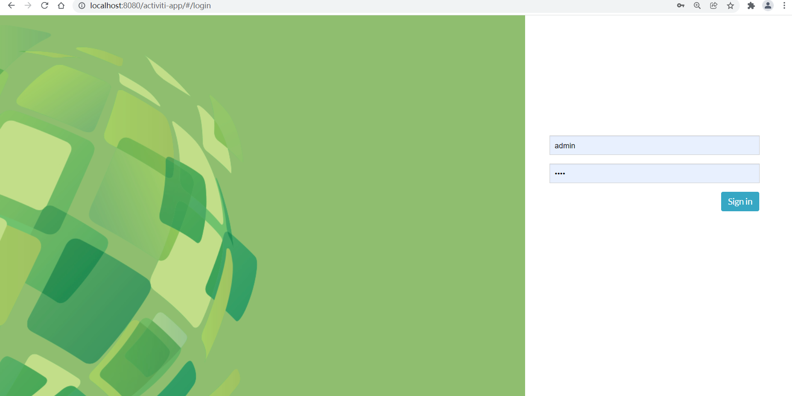
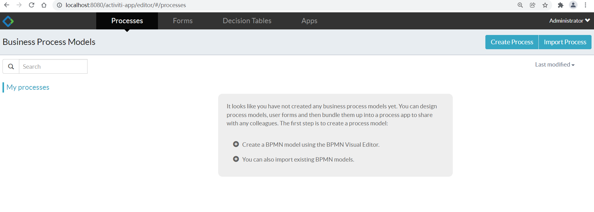
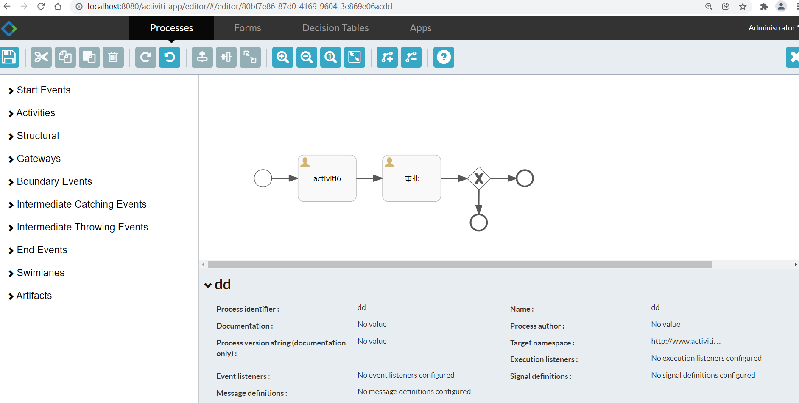
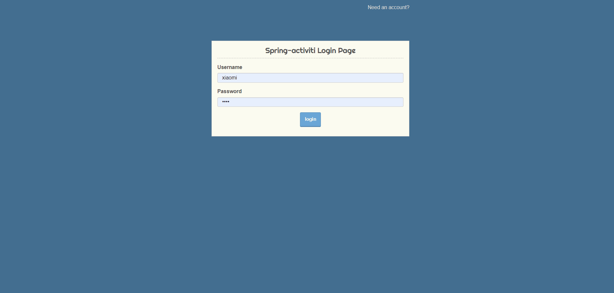
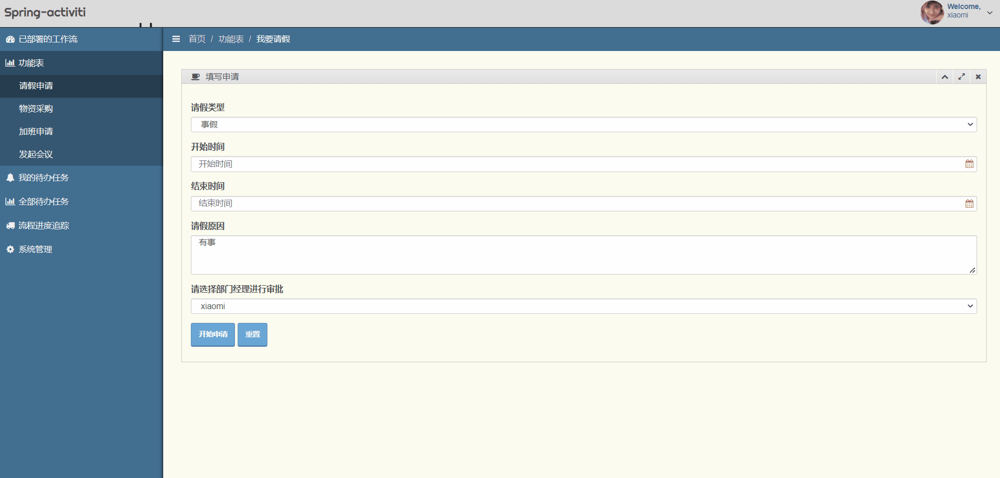
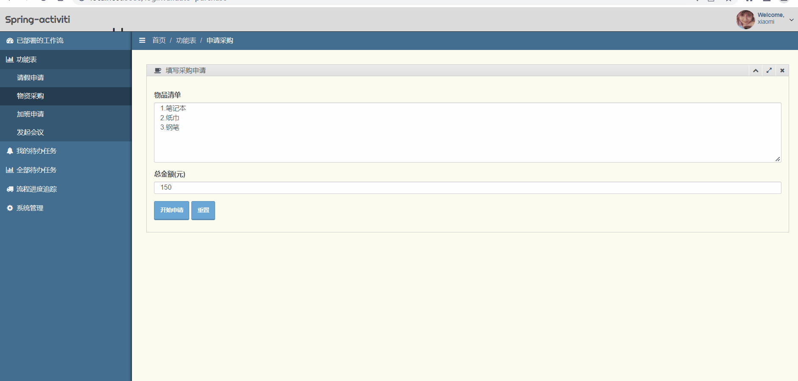
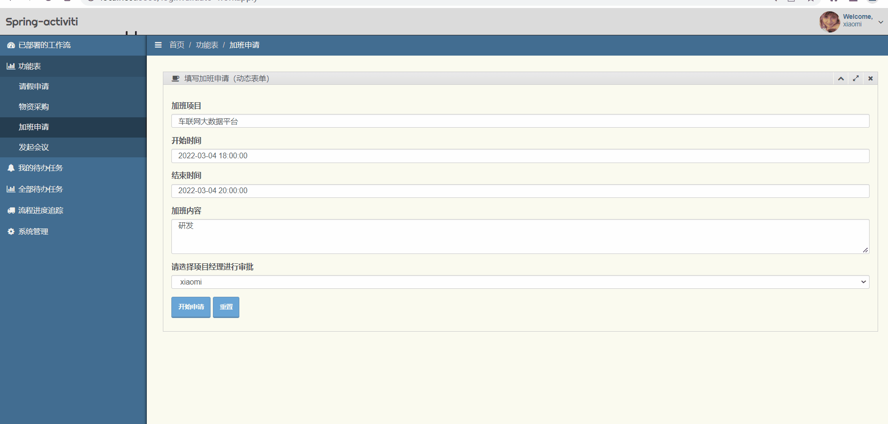
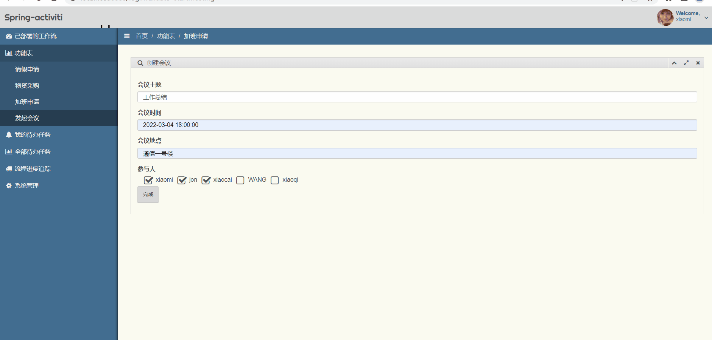

# Spring-activiti6
  在常用的ERP系统、OA系统的开发中，工作流引擎是一个必不可少的工具。本项目旨在基于Spring boot这一平台，整合业界流行的工作流引擎Activiti，并建立了两个完整的工作流进行演示：请假OA和采购流程，本项目基于activiti6.0来开发。

其中包含的内容如下：

1.不采用activiti自带的用户、角色功能，因为过于简单，转而自行实现一个用户、角色、权限的三级结构，用户到角色，角色到权限均为多对多映射；

2.使用默认的用户登录后（用户名xiaomi，密码1234），可看到已部署好的四个流程，请假OA和采购流程、加班申请、发起会议流程，其中，请假OA包含了用户任务、排他网关、起始结束事件，较为简单；采购流程除此之外，还使用了异常结束事件、子流程和边界事件的使用，发起会议流程应用的多实例进行会议签到；

3.四个流程均包含了待办任务签收、运行流程进度追踪、已运行完流程历史记录查看的功能，运行流程进度在流程图中以红色标注；

4.普通表单将流程数据和业务数据相分离，使用业务号（businessKey）建立关联流程数据和业务数据的桥梁，使其相互可以访问,业务数据的主键即为业务号；

5.请假流程和采购流程的表单均使用普通表单，可以分开存放业务数据和流程数据，加班申请流程采用activiti的动态表单，表单业务数据均以变量的形式存入流程数据中;发起会议流程采用外置表单，需要将表单文件与流程图一并打包部署；

6.系统前端采用基于Bootstrap的模板devoops建立。https://github.com/shenzhanwang/devoops

7.起始页面入口：http://localhost:8888/login
使用前，编译(可直接在myeclipse完成)：
```
mvn clean install
```
8. swagger入口：http://localhost:8888/swagger-ui.html
9. 新增流程图设计器，将activiti-app.war放入Tomcat8.5的webapps目录下，启动Tomcat，访问http://localhost:8080/activiti-app ，即可进入登录页面，用户名admin，密码是test：



10. 新增动态菜单权限，通过给不同用户分配不同的角色，使他们看到不同的菜单。
11. 请假流程直接分配到具体审批人，只有指定的审批人才能审批。采购流程按照候选者组进行任务签收，只要能拥有相关菜单的权限即可审批。

12.效果图：







### 附录：中央技术储备仓库（Central Technique Reserve Repository）

#### 基础篇:职业化，从做好OA系统开始
1. [Spring boot整合Mybatis实现增删改查（支持多数据源）](https://gitee.com/shenzhanwang/SSM)
2. [Struts2,Hibernate,Spring三大框架的整合实现增删改查](https://gitee.com/shenzhanwang/S2SH)
3. [Spring,SpringMVC和Hibernate的整合实现增删改查](https://gitee.com/shenzhanwang/SSH)
4. [Spring boot整合activiti工作流引擎实现OA开发](https://gitee.com/shenzhanwang/Spring-activiti)
5. [Spring发布与调用REST风格的WebService](https://gitee.com/shenzhanwang/Spring-REST)
6. [Spring boot整合Axis调用SOAP风格的web服务](https://gitee.com/shenzhanwang/Spring-axis)
7. [Spring boot整合Apache Shiro实现RBAC权限控制](https://gitee.com/shenzhanwang/Spring-shiro)
8. [使用Spring security实现RBAC权限控制](https://gitee.com/shenzhanwang/spring-security-demo)
#### 中级篇：中间件的各种姿势
9. [Spring boot整合mongoDB文档数据库实现增删改查](https://gitee.com/shenzhanwang/Spring-mongoDB)
10. [Spring连接Redis实现缓存](https://gitee.com/shenzhanwang/Spring-redis)
11. [Spring连接图存数据库Neo4j实现增删改查](https://gitee.com/shenzhanwang/Spring-neo4j)
12. Spring boot整合列存数据库hbase实现增删改查
13. [Spring平台整合消息队列ActiveMQ实现发布订阅、生产者消费者模型（JMS）](https://gitee.com/shenzhanwang/Spring-activeMQ)
14. [Spring boot整合消息队列RabbitMQ实现四种消息模式（AMQP）](https://gitee.com/shenzhanwang/Spring-rabbitMQ)
15. Spring boot整合kafka 2.1.0实现大数据消息管道
16. [Spring boot整合websocket实现即时通讯](https://gitee.com/shenzhanwang/Spring-websocket)
17. [Spring security整合oauth2实现token认证](https://gitee.com/shenzhanwang/Spring-security-oauth2)
18. [Spring boot整合MinIO客户端实现文件管理](https://gitee.com/shenzhanwang/Spring-minio)
19. 23种设计模式，源码、注释、使用场景 
20. [使用ETL工具Kettle的实例](https://gitee.com/shenzhanwang/Kettle-demo)
21. Git指南和分支管理策略 
22. 使用数据仓库进行OLAP数据分析（Mysql+Kettle+Zeppelin）
#### 高级篇：分布式系统和大数据开发
23. [zookeeper原理、架构、使用场景和可视化](https://gitee.com/shenzhanwang/zookeeper-practice)
24. Spring boot整合Apache dubbo v2.7.5实现分布式服务治理（SOA架构）  
>  包含组件Spring boot v2.2.2+Dubbo v2.7.5+Nacos v1.1.1
<a href="https://images.gitee.com/uploads/images/2020/0114/084731_fd0b7a82_1110335.gif" target="_blank">效果图</a>
25. 使用Spring Cloud Alibaba v2.2.7实现微服务架构（MSA架构）   
>  包含组件Nacos+Feign+Gateway+Ribbon+Sentinel+Zipkin
<a href="https://images.gitee.com/uploads/images/2020/0106/201827_ac61db63_1110335.gif" target="_blank">效果图</a>
26. 使用jenkins+centos+git+maven搭建持续集成环境自动化部署分布式服务 
27. 使用docker+compose+jenkins+gitlab+spring cloud实现微服务的编排、持续集成和动态扩容 
28. 使用Spark进行分布式计算
- Spark SQL做离线计算
- Spark Streaming做实时计算
- Structured Streaming做实时计算
29. 使用Flink实现流批一体化的分布式计算
30. 搭建高可用nginx集群和Tomcat负载均衡 
31. 使用mycat实现Mysql数据库的主从复制、读写分离、分表分库、负载均衡和高可用 
32. [Spring boot整合Elastic search实现全文检索和大数据分析](https://gitee.com/shenzhanwang/Spring-elastic_search) 
#### 特别篇：分布式事务和并发控制
33. 基于可靠消息最终一致性实现分布式事务（activeMQ）
34. Spring boot dubbo整合seata实现分布式事务
> 包含组件nacos v2.0.2 + seata v1.4.2 +spring boot dubbo v2.7.5
<a href="https://images.gitee.com/uploads/images/2020/0119/112233_62a33a77_1110335.gif" target="_blank">效果图</a>
35. Spring cloud alibaba v2.2.7整合seata实现分布式事务 
> 包含组件nacos v2.0.2 + seata v1.4.2 +spring cloud alibaba v2.2.7
<a href="https://images.gitee.com/uploads/images/2020/0119/134408_ee14a016_1110335.gif" target="_blank">效果图</a>
36. 并发控制：数据库锁机制和事务隔离级别的实现 
37. 并发控制：使用redission实现分布式锁 
38. 并发控制：使用zookeeper实现分布式锁 
39. 并发控制：Java多线程编程实例
40. 并发控制：使用netty实现高性能NIO通信 
### 视频教程


<a href="https://www.roncoo.com/view/1303618857169457154" target="_blank">在线观看（含源码和PPT）</a>
### 关注微信公众号获取更多技术文章和源码
